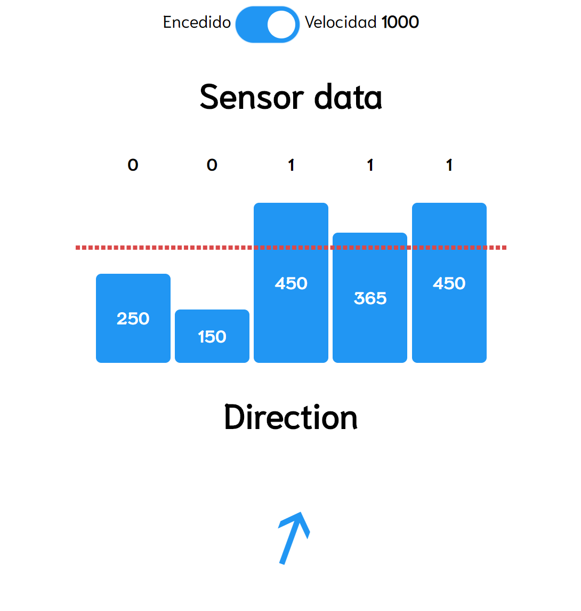

# picarUI
Monitor de LineFollower de piCAR-S

## Instalar
1. Descargar/clonar codigo
2. Correr comando 
```bash
  npm install
```
3. Listo

## Correr
Correr el comando
```bash
  npm start
```
Ahora el serivicio está corriendo en el puerto 80, para abrir el app solo hay que navegar al IP del raspberryPI.
Podría dar error si el puerto 80 ya está corriendo.

## API
| Metodo                  | Uso y función                                                                                             |
|-------------------------|-----------------------------------------------------------------------------------------------------------|
| **POST** /sensors/:data | Hacer un pedido POST así `<ip>/sensors/[200,200,200,200,200]`, la variable tiene que estar en ese formato |
| **POST** /speed/:data   | Hacer un pedido POST así `<ip>/speed/200`, la variable tiene que ser un entero                            |
| **GET** /on             | Hacer un pedido GET así `<ip>/on`, esto retorna un buleano si hay que iniciar o terminar el proceso       |